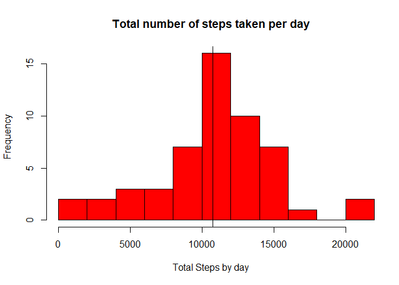
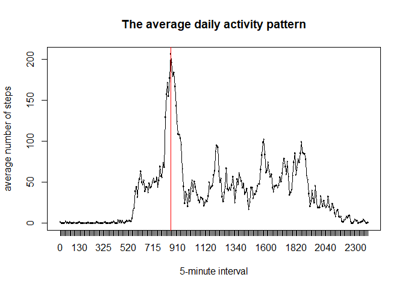
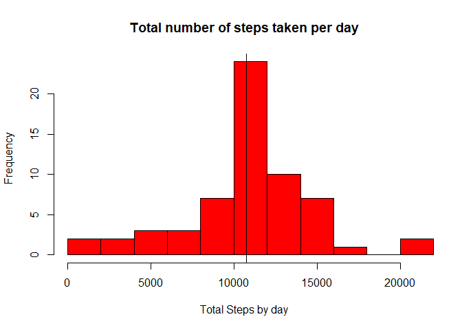
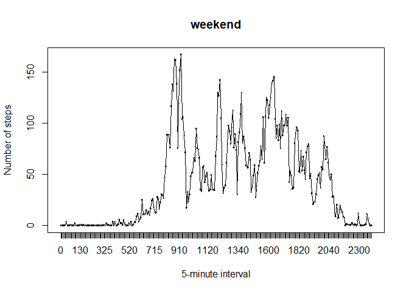
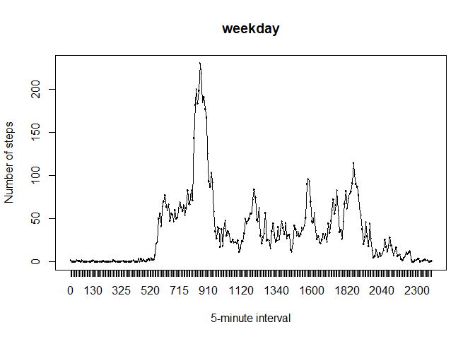

## Loading and preprocessing the data

```r
DT<-read.csv("C:/Users/Romain/Desktop/datasciencecoursera/Reproductible Research/Project 1/activity.csv")
head(DT)
```

```
##   steps       date interval
## 1    NA 2012-10-01        0
## 2    NA 2012-10-01        5
## 3    NA 2012-10-01       10
## 4    NA 2012-10-01       15
## 5    NA 2012-10-01       20
## 6    NA 2012-10-01       25
```

```r
DT$date<-as.Date(DT$date,format = "%Y-%m-%d")
class(DT$date)
```

```
## [1] "Date"
```

```r
DT<-DT[complete.cases(DT),]
```

## What is mean total number of steps taken per day?

```r
sumsteps<-tapply(DT$steps,DT$date,sum)

sumsteps<-as.data.frame.table(sumsteps)

hist(sumsteps$Freq,breaks = 10,col="red",
     xlim = c(41,21194),
     xlab = "Total Steps by day",
     main = "Total number of steps taken per day")

abline(v=median(sumsteps$Freq),col="blue")
median(sumsteps$Freq)
```

```
## [1] 10765
```

```r
abline(v=mean(sumsteps$Freq),col="black")
```

<!-- -->

```r
mean(sumsteps$Freq)
```

```
## [1] 10766.19
```

## What is the average daily activity pattern?

```r
stepbyinterval<-tapply(DT$steps,DT$interval,mean)

stepbyinterval<-as.data.frame.table(stepbyinterval)

plot(stepbyinterval$Var1,stepbyinterval$Freq, "l",
     xlab="5-minute interval",
     ylab="average number of steps",
     main="The average daily activity pattern")

lines(as.numeric(stepbyinterval$Var1),stepbyinterval$Freq, "l", col = "black")

stepbyinterval[which(stepbyinterval$Freq==max(stepbyinterval$Freq)),1]
```

```
## [1] 835
## 288 Levels: 0 5 10 15 20 25 30 35 40 45 50 55 100 105 110 115 120 125 ... 2355
```

```r
abline(v=stepbyinterval[which(stepbyinterval$Freq==max(stepbyinterval$Freq)),1],
       col="red")
```

<!-- -->

## Imputing missing values
The strategy chosen for imputing missing data is to fill by the mean of each interval
corresponding.

```r
DT<-read.csv("C:/Users/Romain/Desktop/datasciencecoursera/Reproductible Research/Project 1/activity.csv")

DTna<-DT[is.na(DT$steps), ]

newDT<-data.frame(steps=stepbyinterval
                  [match(DTna$interval,stepbyinterval$Var1),2],
                  date=DTna$date,
                  interval=DTna$interval)

DTcc<-DT[complete.cases(DT),]

fDT<-rbind(newDT,DTcc)

fDT$date<-as.Date(fDT$date,format = "%Y-%m-%d")

sumsteps2<-tapply(fDT$steps,fDT$date,sum)
sumsteps2<-as.data.frame.table(sumsteps2)

hist(sumsteps2$Freq,breaks = 10,col="red",
     xlim = c(41,21194),xlab = "Total Steps by day",
     main = "Total number of steps taken per day")

abline(v=median(sumsteps2$Freq),col="blue")
abline(v=mean(sumsteps2$Freq),col="black")
```

<!-- -->
This strategy doesn't doesn't change the Histogram.

## Are there differences in activity patterns between weekdays and weekends?
First we create a new column with the factor : weekdays and weekends.

```r
library(dplyr)
```

```
## 
## Attaching package: 'dplyr'
```

```
## The following objects are masked from 'package:stats':
## 
##     filter, lag
```

```
## The following objects are masked from 'package:base':
## 
##     intersect, setdiff, setequal, union
```

```r
wkDT<-mutate(fDT,day=weekdays(fDT$date))

NewVar <- factor(rep(NA, length(wkDT$day) ), 
                 levels=c("weekday", "weekend") )   
NewVar[ wkDT$day %in% c("lundi", "mardi", "mercredi","jeudi","vendredi")]<-"weekday"
NewVar[ is.na(NewVar) ]<-"weekend"

wkDT<-cbind(wkDT,NewVar)

wkDT1<-subset(wkDT,wkDT$NewVar=="weekday")
wkDT1interval<-tapply(wkDT1$steps,wkDT1$interval,mean)
wkDT1interval<-as.data.frame.table(wkDT1interval)

wkDT2<-subset(wkDT,wkDT$NewVar=="weekend")
wkDT2interval<-tapply(wkDT2$steps,wkDT2$interval,mean)
wkDT2interval<-as.data.frame.table(wkDT2interval)

plot(wkDT2interval$Var1,wkDT2interval$Freq, "l",xlab="5-minute interval",
     ylab="Number of steps",main="weekend")
lines(as.numeric(wkDT2interval$Var1),wkDT2interval$Freq, "l", col = "black")
```

<!-- -->

```r
plot(wkDT1interval$Var1,wkDT1interval$Freq, "l",xlab="5-minute interval",
     ylab="Number of steps",main="weekday")
lines(as.numeric(wkDT1interval$Var1),wkDT1interval$Freq, "l", col = "black")
```

<!-- -->
We can see that the patterns are different
